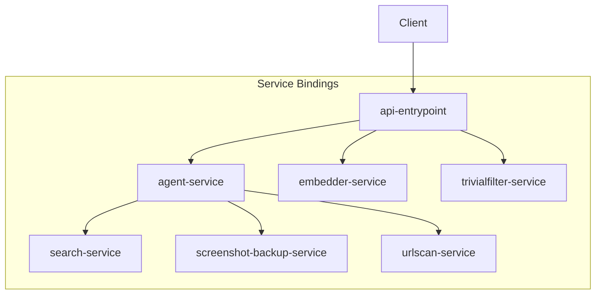

# Introduction

This is a monorepo for the Cloudflare Workers-based AI service that CheckMate users.

# Cloudflare Workers Architecture



The diagram above illustrates how our Cloudflare Workers connect to each other through service bindings:

- **api-entrypoint**: The main entry point that clients interact with
- **agent-service**: Handles AI agent orchestration and processing, as well as tool implementation. Note, search, screenshot, and urlscan tools are implemented as separate services but called within agent service.
- **screenshot-service**: Captures and processes website screenshots
- **screenshot-backup-service**: Captures and processes website screenshots, but calls the checkmate-screenshots GCP cloud function to do so instead of doing it natively in Cloudflare workers
- **search-service**: Implementation of google search tool
- **urlscan-service**: Analyzes URLs for malicious content
- **embedder-service**: Embeds URLs into a 384-dim vector using BGE
- **trivialfilter-service**: Determines if submissions are worth checking

Each worker can directly communicate with others through Cloudflare Workers service bindings, allowing for efficient microservice architecture without additional network hops.

# Installation

1. Install pnpm globally (if not already installed):

```bash
npm install -g pnpm
```

2. Clone the repository:

```bash
git clone https://github.com/checkmate-sg/ai-monorepo.git
cd ai-monorepo
```

3. Install dependencies:

```bash
pnpm install
```

4. Set up environment variables:

   - Copy `.dev.vars.example` to `.dev.vars` in each worker directory
   - Fill in the required environment variables in each `.dev.vars` file

# Development

- To run a specific worker:

```bash
pnpm run dev:<worker-name>
```

- To run all workers simultaneously:

```bash
pnpm run dev
```

This will start all workers concurrently based on the pipeline configuration in `turbo.json`. You can access them at:

- api-entrypoint: http://127.0.0.1:8787
- agent-service: http://127.0.0.1:8788
- screenshot-service: http://127.0.0.1:8789
- search-service: http://127.0.0.1:8790
- urlscan-service: http://127.0.0.1:8791
- screenshot-backup-service: http://127.0.0.1:8792
- embedder-service: http://127.0.0.1:8793
- trivialfilter-service: http://127.0.0.1:8794

# Cloudflare Workers Deployment via GitHub Actions

## Prerequisites

Set the following environment secrets in GitHub:

- `CLOUDFLARE_API_TOKEN`
- `CLOUDFLARE_ACCOUNT_ID`

Cloudflare API token can be created using the `Edit Worker` template.

Refer to deploy_worker.yml to set all other worker-specific secrets in GitHub.

Deploy independent workers first, followed by workers that depend on other workers, as service binding requires the dependent worker to exist beforehand.

## Automated CF Worker Deployment 

Triggered on PRs to `staging` or `main`:

- `main` branch: `wrangler deploy --env production`
- `staging` branch: `wrangler deploy --env staging`

### Selective Deployment

- Changes in a specific worker folder trigger deployment for that worker only.
- Changes in a shared folder trigger deployment for all workers.

## Manual CF Worker Deployment 

**Note:** Workflow YAML must be merged into default branch before manual execution.

### When to Use Manual Deployment

- Worker deleted with no changes to trigger automation.
- Deployment drift between GitHub Actions and local `wrangler deploy`.

### Steps

1. Go to **Actions** > **Deploy CF Worker**.
2. Click **Run workflow**.
3. Choose **Force all deployment** or input a specific worker name.

## Manual CF Secrets Deployment 

CF Workers must be deployed first before triggering CF Secrets deployment.

### Steps

1. Go to **Actions** > **Deploy CF Secrets**.
2. Click **Run workflow**.
3. Choose **Force all deployment** or input a specific worker name.

## How to update portkey worker

Trigger 'Deploy Portkey to CF Worker' workflow

## How to Share Environment Variables for Local Development with Other Developers

# Via Telegram
1. Ensure that `TELEGRAM_BOT_TOKEN` is configured in GitHub Secrets for the "local" environment.
2. Ask the developer to retrieve their chat ID from Telegram.
3. Go to **Actions > Share Local Env workflow > Run workflow**, and enter the developer’s chat ID.

# Via Gmail SMTP
1. Generate an app password from [https://myaccount.google.com/](https://myaccount.google.com/).
2. Store the app password in `GMAIL_APP_PASSWORD` in GitHub Secrets for the "local" environment.
3. Store the Gmail address in `GMAIL_USER` in GitHub Secrets for the "local" environment.
4. Go to **Actions > Share Local Env** workflow, click **Run workflow**, and enter the developer's email.