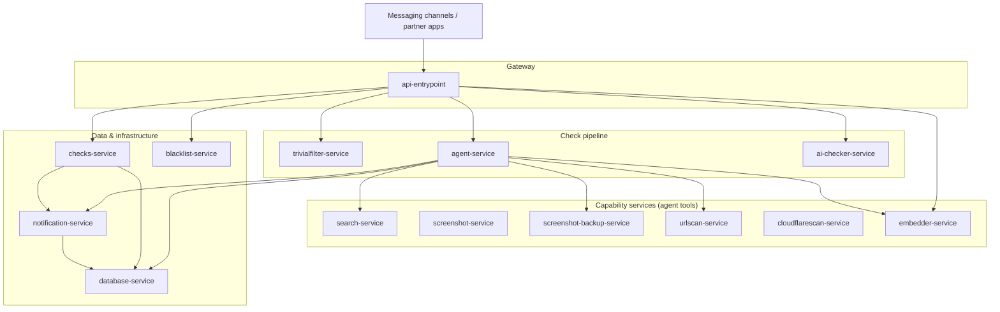

# CheckMate AI — Monorepo

This repository is the **AI backend that powers [CheckMate](https://checkmate.sg)** — a service that helps people in Singapore check whether a suspicious message, image, or link is a scam, misinformation, or something legitimate.

It is built entirely on **Cloudflare Workers** as a set of small services that talk to each other through Cloudflare **service bindings** (in-process RPC, no network hops). The heart of the system is an **AI agent** that researches a submission using web search, screenshots, and URL-reputation tools, then writes up a fact-check in two forms: a long-form report and a short, shareable "community note."

---

## Table of contents

- [Business context](#business-context)
- [What this repo does](#what-this-repo-does)
- [System architecture](#system-architecture)
- [Services reference](#services-reference)
- [The check lifecycle](#the-check-lifecycle)
- [The agentic loop](#the-agentic-loop)
- [The agent's tools](#the-agents-tools)
- [Data model](#data-model)
- [API surface](#api-surface)
- [Local development](#local-development)
- [Deployment](#deployment)
- [Observability](#observability)
- [Repository layout](#repository-layout)

---

## Business context

**CheckMate** is a Singapore non-profit run by a community of volunteers. Its goal is to make fact-checking *easy and accessible*: anyone can forward a suspicious WhatsApp message, screenshot, or link to CheckMate and get back a clear assessment of whether it is a scam, misinformation, or trustworthy — with sources, in about a minute or two. Every user gets a handful of free checks each month.

The product blends **two layers of trust**:

1. **AI triage** — an agent reads the submission, researches it across the web, and drafts an answer automatically. This is what this repository implements.
2. **Human / crowd oversight** — submissions can be routed to volunteer fact-checkers who vote on a category and can override or approve the machine's answer before it is treated as authoritative. The backend exposes the hooks for this (voting polls, human notes, approval/publishing flags), even though the volunteer-facing apps live in other repositories.

Users typically reach CheckMate through messaging channels (e.g. a WhatsApp bot). Those channels call this backend over an authenticated HTTP API; the backend does the analysis and persists the result so repeat submissions of the same content can be answered instantly.

> Learn more about the product and the team at [checkmate.sg](https://checkmate.sg) and [checkmate.sg/about](https://checkmate.sg/about).

---

## What this repo does

In one sentence: **it takes a piece of content, decides whether it is worth checking, runs an AI agent that researches it, and returns + stores a structured fact-check.**

Concretely, the backend is responsible for:

- Authenticating and rate-limiting API consumers (the messaging channels and partner apps).
- Filtering out trivial submissions that don't need a full check.
- Orchestrating the AI agent and its research tools.
- De-duplicating submissions (so the same forwarded message isn't re-researched from scratch).
- Persisting checks and submissions to a database.
- Notifying downstream systems (e.g. a Telegram channel for reviewers) and triggering crowd-voting where applicable.

---

## System architecture


```mermaid
graph TD
    Client[Messaging channels / partner apps]

    subgraph Gateway
      API[api-entrypoint]
    end

    subgraph "Check pipeline"
      Trivial[trivialfilter-service]
      Agent[agent-service]
      AICheck[ai-checker-service]
    end

    subgraph "Capability services (agent tools)"
      Search[search-service]
      Shot[screenshot-service]
      ShotBackup[screenshot-backup-service]
      URLScan[urlscan-service]
      CFScan[cloudflarescan-service]
      Embed[embedder-service]
    end

    subgraph "Data & infrastructure"
      DB[database-service]
      Checks[checks-service]
      Blacklist[blacklist-service]
      Notify[notification-service]
    end

    Client --> API
    API --> Trivial
    API --> Agent
    API --> AICheck
    API --> Embed
    API --> Blacklist
    API --> Checks

    Agent --> Search
    Agent --> ShotBackup
    Agent --> URLScan
    Agent --> Embed
    Agent --> DB
    Agent --> Notify

    Checks --> DB
    Checks --> Notify
    Notify --> DB
```

**Why service bindings?** Every box above is its own Cloudflare Worker, but they don't call each other over the public internet. They're wired together with [service bindings](https://developers.cloudflare.com/workers/runtime-apis/bindings/service-bindings/), so an inter-service call is a direct, zero-latency RPC method invocation. Most services therefore expose their functionality as typed RPC methods (via `WorkerEntrypoint`) rather than HTTP routes — only `api-entrypoint` exposes a real public HTTP API.

The services fall into five tiers:

| Tier | Services | Role |
|------|----------|------|
| **Gateway** | `api-entrypoint` | The only public HTTP surface. Auth, rate-limiting, routing. |
| **Check pipeline** | `trivialfilter-service`, `agent-service`, `ai-checker-service` | Decide whether to check, then produce the fact-check. |
| **Capability services** | `search-service`, `screenshot-service`, `screenshot-backup-service`, `urlscan-service`, `cloudflarescan-service`, `embedder-service` | Single-purpose tools the agent relies on. |
| **Data & infrastructure** | `database-service`, `checks-service`, `blacklist-service`, `notification-service` | Persistence, check lifecycle events, blacklists, notifications. |
| **LLM gateway** | `portkey-service` | The Portkey gateway that **every** LLM call routes through. Live in production; source lives outside this repo (config-only here). |
| **Scaffolding / inactive** | `ai-checker-service`, `digest-service` | Present in the repo but not in active use (see below). |

---

## Services reference

> Ports below are the local-dev ports defined in each worker's `wrangler.jsonc`.

### Gateway

- **`api-entrypoint`** (`:8787`) — Built on **Hono** + **Chanfana** (auto-generated OpenAPI 3.1). It's the single entry point for all external traffic.
  - **`consumerAuth` middleware**: validates an `X-API-Key`, looks the consumer up in the **`Consumer` Durable Object** (backed by the `CONSUMER_KV` namespace), checks the consumer is allowed to call the requested API, enforces a **token-bucket rate limit**, and increments usage counters.
  - **`adminAuth` middleware**: validates a Cloudflare Access JWT for admin/consumer-management endpoints (bypassed in development).
  - Binds to: `EMBEDDER_SERVICE`, `AGENT_SERVICE`, `TRIVIAL_FILTER_SERVICE`, `BLACKLIST_SERVICE`, `AI_CHECKER_SERVICE`, `CHECKS_SERVICE`. Produces to the `checkers-poll-update-queue`.

### Check pipeline

- **`agent-service`** (`:8788`) — The core AI engine. Each submission runs inside a **`CheckerAgent` Durable Object**. Orchestrates the agentic research loop (see below), persists results, and emits events. Rich set of bindings: screenshot, search, URL-scan, embedder, database, notification, image-hash (`pdq-worker`), checkers-webhook, and presigned-URL services; a `CHECKMATE_IMAGES_BUCKET` R2 bucket; and the `core-check-events-queue`.
- **`ai-checker-service`** (`:8798`) — An alternative ("V2") checker with the same shape as `agent-service`, but wired to the **native** screenshot service and to `cloudflarescan-service` for URL scanning. Reached via `api-entrypoint`'s `getAgentResultV2` route. **Not currently in use** — `agent-service` is the active checker.
- **`trivialfilter-service`** (`:8794`) — A lightweight LLM gate that decides whether a submission is even worth a full check (deterministic settings: `temperature: 0`, fixed seed, JSON-schema output of `{ reasoning, needs_checking }`).

### Capability services (the agent's tools)

- **`search-service`** (`:8790`) — Google search via the **Serper** API, biased to Singapore (`gl: sg`, `location: Singapore`). Returns organic results.
- **`screenshot-service`** (`:8789`) — Native Cloudflare screenshot capture (Puppeteer). Stores images in the `screenshots` R2 bucket. Used in **staging/production**.
- **`screenshot-backup-service`** (`:8793`) — Fallback screenshot capture that calls a **GCP Cloud Function** (authenticated with a Google OAuth token). Used in **development**.
- **`urlscan-service`** (`:8791`) — Calls an external URL-reputation API and returns a verdict + maliciousness score.
- **`cloudflarescan-service`** (`:8800`) — A Cloudflare-based URL/screenshot scanner used by `ai-checker-service` (writes to the `screenshots` bucket).
- **`embedder-service`** (`:8792`) — Generates **384-dimensional BGE embeddings** (`@cf/baai/bge-small-en-v1.5`) using Cloudflare Workers AI. Used for semantic de-duplication of checks.

### Data & infrastructure

- **`database-service`** (`:8795`) — MongoDB access via a **`DatabaseDurableObject`** that holds a persistent connection pool to the `checkmate-core` database (`checks` and `submissions` collections). Exposes typed RPC methods (`insertCheck`, `findCheckById`, `findCheckByTextHash`, `findCheckByImageHash`, `updateCheck`, `insertSubmission`, `findSubmissionById`, …). Serializes Mongo `ObjectId`s to strings before returning them over RPC.
- **`checks-service`** (`:8799`) — Operations around the check lifecycle; consumes/produces the `core-check-events-queue` and `checkers-poll-update-queue`.
- **`blacklist-service`** (`:8796`) — Maintains a ScamShield-style blacklist in KV (`SCAMSHIELD_BLACKLIST_KV`).
- **`notification-service`** (`:8797`) — Sends notifications (e.g. to a Telegram channel for reviewers): new check, community-note ready, newly-assessed, category change, downvote. Reads from `database-service`.

### LLM gateway

- **`portkey-service`** — The [Portkey](https://portkey.ai) AI gateway that **every** LLM call routes through. The shared LLM client points its `baseURL` at `PORTKEY_ENDPOINT` (e.g. `https://portkey.staging.checkmate.sg/v1`), which is this worker's custom domain (`portkey.checkmate.sg` / `portkey.staging.checkmate.sg`). **It is live and in the request path**, but in this repo it is **config-only**: the directory contains just a `wrangler.jsonc` claiming the custom domain — there is no `package.json` or `src/` (the `main: src/index.ts` it references is absent). The gateway itself is the Portkey OSS gateway, deployed out-of-band, so this worker is **not** built by `pnpm build` or run by `pnpm dev`.

### Scaffolding / inactive

- **`ai-checker-service`** — Deployed and part of the dev fleet, but the V2 check path it serves is **not currently used** (see Check pipeline above).
- **`digest-service`** — Only a `.dev.vars` file; **no source or config**. Placeholder for a future digest feature.

---

## The check lifecycle

When a full check is requested (`POST /getAgentResult` → `AGENT_SERVICE.check(request)`), the `CheckerAgent` Durable Object runs roughly this sequence:

1. **Resolve model & provider.** Default model is **`gpt-4.1-mini`**; a request can override it. The provider is inferred from the model name (`gpt*` → OpenAI, `gemini*` → Vertex AI, `llama*` → Groq) and all calls route through the **Portkey** gateway, traced in **Langfuse**.
2. **Insert a `pending` check** into MongoDB, computing hashes up front — `textHash`, `captionHash`, `imageHash`, and a PDQ vector for images — so identical content can be de-duplicated later. (In staging/production, image submissions are first turned into a **presigned R2 URL**.)
3. **Notify** the reviewer channel that a new check has arrived.
4. **Embed** the text (or image caption) via `embedder-service` and store the vector in the background.
5. **`preprocess_inputs`** (deterministic, 30s timeout) — an LLM step that infers the user's *intent*, whether the content *can be assessed*, whether access is blocked or it's a video, and a short *title*. It also assembles the initial `startingContent` message for the agent.
6. **Run the agent loop** (120s timeout) — the LLM researches and drafts the report (detailed below).
7. **`summarise_report`** (deterministic) — condense the long report into a ~50–100 word, X-style **community note** in English.
8. **`translate_text`** (deterministic) — translate the community note into **Chinese**.
9. **Assemble & persist** the final result: a `longformResponse` (English report + sources) and a `shortformResponse` (English + Chinese community note + sources). Mark the check `completed` and notify the channel.
10. **Trigger crowd voting** — for the `checkmate-whatsapp` consumer, post to the checkers-webhook service to open a volunteer voting poll.
11. **Flush Langfuse** traces.

> **Languages note:** although the data types model several languages, the agent currently generates the community note in **English and Chinese (`en`, `cn`)** only.

If any stage throws, the check is marked with a specific error status (`error-preprocessing`, `error-agentLoop`, `error-summarization`, `error-translation`, or `error-other`) and an error notification is sent.

---

## The agentic loop

The loop lives in `agent-service/src/agent.ts` (`CheckerAgent.agentLoop`). Conceptually:

- **Setup.** The system prompt is **fetched from Langfuse** (`agent_system_prompt`, labelled per environment) and compiled with the current datetime and the remaining search/screenshot budgets. The conversation starts as `[system prompt, user content]`, where the user content is what `preprocess_inputs` prepared (the text and/or the image).
- **Decode settings.** Each turn calls the chat-completions API with `temperature: 0` and a fixed `seed` for reproducibility, and crucially **`tool_choice: "required"`** — the model *must* call a tool every turn; it cannot reply with free-form prose.
- **Iterate.** On each turn the model picks one or more tools. All tool calls in a turn run **in parallel**; their results are appended to the conversation (tool-role messages first, then any image/user messages — important so screenshots attach correctly).
- **Budgets.** The agent starts with **5 Google searches** and **5 screenshots**. As each budget is exhausted, that tool is *removed* from the tool list for subsequent turns, nudging the model toward concluding.
- **Termination.** The loop ends when the model calls **`submit_report_for_review`** and the report passes an internal review gate. At that point the loop returns the final `report`, `sources`, and `is_controversial` flag. As a safety valve, the loop also hard-stops if the conversation exceeds 50 messages (treated as a failure).

**Which tools the model actually sees.** Even though the codebase defines nine tools, the loop deliberately exposes only **four** to the model:

- `search_google`
- `get_website_screenshot`
- `check_malicious_url`
- `submit_report_for_review`

The others are either **called deterministically by the orchestration code** outside the loop (`preprocess_inputs`, `summarise_report`, `translate_text`) or are **defined but currently disabled in the loop** (`extract_image_urls`, `search_internal`). This keeps the agent's decision space small and focused on research → conclude.

---

## The agent's tools

### Active in the loop (the model chooses these)

| Tool | What it does | Backed by |
|------|--------------|-----------|
| **`search_google`** | Runs a Google search for a query and returns organic results. Budget: 5 calls. | `search-service` → Serper |
| **`get_website_screenshot`** | Takes a screenshot of a URL and feeds the **image back into the conversation** so the (vision-capable) model can read the page. Budget: 5 calls. | `screenshot-service` (prod) / `screenshot-backup-service` (dev) |
| **`check_malicious_url`** | Scans a URL and returns `MALICIOUS` / `SUSPICIOUS` / `BENIGN` plus a 0–1 score. (A "malicious" verdict is trustworthy; a "benign" verdict is weaker evidence.) | `urlscan-service` |
| **`submit_report_for_review`** | The model's way to **finish**: it submits the drafted report, its source links, and an `is_controversial` flag. An internal review step critiques the draft; if it passes, the loop concludes, otherwise feedback is returned and the agent revises. | LLM (self-review) |

### Called deterministically by the orchestrator (not the model's choice)

| Tool | When | What it does |
|------|------|--------------|
| **`preprocess_inputs`** | Before the loop | Infers intent / assessability / blocked-access / video flags / a short title, and builds the agent's opening message. |
| **`summarise_report`** | After the loop | Compresses the long report into a ~50–100 word community note. |
| **`translate_text`** | After the loop | Translates the community note (used here for English → Chinese). |

### Defined but currently dormant

| Tool | Intended purpose |
|------|------------------|
| **`extract_image_urls`** | Pull image URLs out of a piece of content for downstream screenshotting. |
| **`search_internal`** | Semantic search over *past* checks to reuse a previous community note for the same claim (paired with a `confirm_same_claim` check). |

---

## Data model

The two core MongoDB collections (in `checkmate-core`) are **`checks`** and **`submissions`**. Key concepts on a **Check**:

- **`longformResponse`** — the detailed report (`en`, optional `cn`, `links`, `timestamp`).
- **`shortformResponse`** — the community note (`en`, `cn`, `links`, `downvoted`, `timestamp`).
- **De-dup keys** — `textHash`, `captionHash`, `imageHash`, plus embedding vectors (`embeddings.text`, `embeddings.caption`, `embeddings.pdq`).
- **Categorisation** — `machineCategory` (from the AI) and `crowdsourcedCategory` (from volunteer votes; defaults to `"unsure"`). Categories are one of `Scam | Illicit | Info | Spam | Trivial | Irrelevant | Error`.
- **Governance flags** — `isHumanAssessed`, `isVoteTriggered`, `isApprovedForPublishing`, `approvedBy`, `humanResponse`.
- **Content flags** — `isControversial`, `isAccessBlocked`, `isVideo`, `isReport`.

Shared types live in `shared/types` (`@workspace/shared-types`) — see `AgentRequest`, `AgentResponse`, `Check`, `Submission`, and the per-service request/response types.

---

## API surface

All public endpoints are served by `api-entrypoint` (OpenAPI docs are generated automatically via Chanfana).

| Method | Path | Purpose |
|--------|------|---------|
| `POST` | `/getEmbedding` | Embed text (→ `embedder-service`) |
| `POST` | `/getAgentResult` | Full check (→ `agent-service`) |
| `POST` | `/getAgentResultV2` | Full check via the alternative checker (→ `ai-checker-service`) — *not currently used* |
| `POST` | `/getCommunityNote` | Community note only |
| `POST` | `/getNeedsChecking` | Trivial filter (→ `trivialfilter-service`) |
| `GET` | `/consumer/details` | Current consumer's details |
| `GET` | `/checks/:id` | Fetch a check |
| `PATCH` | `/checks/:id` | Update a check |
| `PATCH` | `/checks/:id/humanNote` | Attach/update a human review note |
| `POST` | `/upsertBlacklist` | Upsert a blacklist entry (→ `blacklist-service`) |
| `POST`/`GET`/`DELETE` | `/consumers` | Admin: manage API consumers |
| `PUT` | `/consumers/:consumerName/allowedAPIs` | Admin: set which APIs a consumer may call |

Public endpoints require an `X-API-Key`; admin/`consumers` endpoints require a Cloudflare Access JWT.

---

## Local development

### Prerequisites

```bash
npm install -g pnpm   # pnpm 10.5.2 (see packageManager in package.json)
```

### Install

```bash
pnpm install
```

### Environment variables

Each worker reads secrets from a local `.dev.vars` file. Copy `.dev.vars.example` to `.dev.vars` in each worker directory and fill it in. Commonly needed values include `ENVIRONMENT`, the `LANGFUSE_*` keys, `PORTKEY_ENDPOINT` + `CF_ACCESS_CLIENT_ID`/`CF_ACCESS_CLIENT_SECRET`, LLM provider keys (`OPENAI_API_KEY`, Vertex/Groq creds), `SERPER_API_KEY`, the MongoDB connection string, and Telegram credentials for the notification service.

### Run

```bash
pnpm dev          # runs the full local fleet (wrangler multi-worker dev)
pnpm dev:turbo    # same, orchestrated by Turbo

# or a single service:
pnpm dev:agent-service
pnpm dev:api-entrypoint
# (see package.json for the full list)
```

`pnpm dev` starts the 14 active workers together. `portkey-service` and `digest-service` are **not** included.

### Build & lint

```bash
pnpm build   # turbo build across all packages
pnpm lint    # turbo lint
```

### Evals

```bash
pnpm eval          # run the eval suite (workspace: ./evals)
pnpm eval:viewer   # open the eval results viewer
```

### Local ports

| Service | Port |
|---------|------|
| api-entrypoint | 8787 |
| agent-service | 8788 |
| screenshot-service | 8789 |
| search-service | 8790 |
| urlscan-service | 8791 |
| embedder-service | 8792 |
| screenshot-backup-service | 8793 |
| trivialfilter-service | 8794 |
| database-service | 8795 |
| blacklist-service | 8796 |
| notification-service | 8797 |
| ai-checker-service | 8798 |
| checks-service | 8799 |
| cloudflarescan-service | 8800 |

---

## Deployment

Deployments run through **GitHub Actions** and Wrangler:

- **PR to `staging`** → deploys to the staging environment.
- **PR to `main`** → deploys to production.
- **Manual deploys** are available through the Actions UI.

Each worker's `wrangler.jsonc` defines per-environment variants (e.g. `agent-service-staging`) with environment-specific bindings, queue names, and service targets. Production runs under `api.backend.checkmate.sg`.

To deploy a single worker:

```bash
pnpm turbo deploy --filter=<worker-name>
```

Deployments rely on Cloudflare and provider secrets being configured in the GitHub environment (Cloudflare API token & account ID, the database credentials, the Google service account, the `LANGFUSE_*` keys, and `OPENAI_API_KEY`, among others).

---

## Observability

- **Langfuse** traces every LLM interaction end-to-end: one trace per check, with spans per tool call, the prompt version used, and accumulated cost. System prompts are also **managed in Langfuse** and fetched at runtime (labelled per environment), so prompt changes don't require a redeploy.
- **Portkey** (self-hosted at `portkey.checkmate.sg`, the `portkey-service` worker) sits in front of the LLM providers as a unified gateway/router; the shared LLM client targets it via `PORTKEY_ENDPOINT`.
- **Pino** provides structured logging across all workers, and a tail-consumer worker is bound in production for log streaming.

---

## Repository layout

```
/
├── shared/
│   ├── llmClient/   # @workspace/shared-llm-client — Portkey-fronted OpenAI client (OpenAI / Vertex / Groq)
│   ├── types/       # @workspace/shared-types — CheckRequest, AgentRequest/Response, Check, Submission, ...
│   └── utils/       # @workspace/shared-utils — logger, hashing (text/image/PDQ), Google auth, slugs, provider lookup
├── workers/
│   ├── api-entrypoint/          # public HTTP gateway (Hono + Chanfana)
│   ├── agent-service/           # core AI agent (CheckerAgent Durable Object)
│   ├── ai-checker-service/      # alternative checker (V2) — not currently used
│   ├── trivialfilter-service/   # "is this worth checking?" gate
│   ├── search-service/          # Google search (Serper)
│   ├── screenshot-service/      # native screenshot capture
│   ├── screenshot-backup-service/ # GCP-based screenshot fallback
│   ├── urlscan-service/         # URL reputation
│   ├── cloudflarescan-service/  # CF-based URL/screenshot scan
│   ├── embedder-service/        # BGE embeddings (Workers AI)
│   ├── database-service/        # MongoDB access (DatabaseDurableObject)
│   ├── checks-service/          # check lifecycle / queue events
│   ├── blacklist-service/       # ScamShield blacklist (KV)
│   ├── notification-service/    # Telegram notifications
│   ├── portkey-service/         # Portkey LLM gateway (config-only here; live at portkey.checkmate.sg)
│   └── digest-service/          # (scaffolding — no source)
├── evals/           # evaluation suite
├── turbo.json       # Turbo pipeline config
├── pnpm-workspace.yaml
└── package.json
```

### Tech stack

- **Runtime:** Cloudflare Workers (Durable Objects, KV, R2, Queues, Workers AI, service bindings)
- **Language:** TypeScript
- **AI:** OpenAI / Vertex AI / Groq via Portkey, observed by Langfuse
- **Package manager / build:** pnpm workspaces + Turbo
- **Deploy:** Wrangler + GitHub Actions
- **Database:** MongoDB (`checkmate-core`)
- **Logging:** Pino
